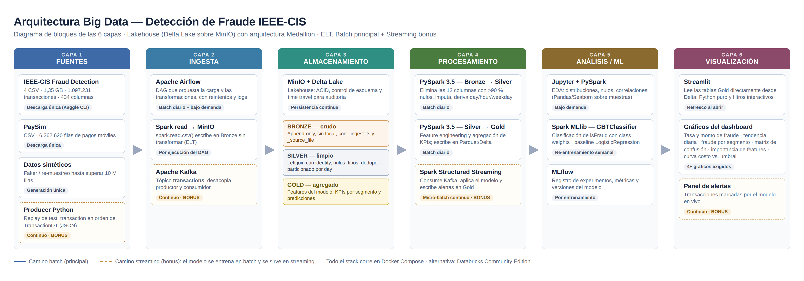

# Detección de Fraude con Big Data — IEEE-CIS

Proyecto final de Big Data. Pipeline Medallion (Bronze → Silver → Gold → modelo) en PySpark y Delta Lake para detectar transacciones fraudulentas con el dataset [IEEE-CIS Fraud Detection](https://www.kaggle.com/c/ieee-fraud-detection), con datos de Vesta Corporation.

| Integrante | Rol |
| --- | --- |
| Julian Andres Rodriguez Largo | Project Manager / Architect |
| Samuel Serrano Riascos | Data Engineer + BI Developer |
| Samantha Elena De Aguas Sabalza | Data Scientist / ML Engineer |

## Preguntas de negocio

| | Pregunta | Dónde se responde |
| --- | --- | --- |
| P1 | ¿Qué patrones caracterizan las transacciones fraudulentas? | `gold/fraude_por_segmento`, notebook `01_eda` |
| P2 | ¿Qué tan bien podemos predecir el fraude y qué variables pesan más? | `src/modelo.py`, notebook `02_modelo` |
| P3 | ¿Qué umbral de decisión minimiza el costo de los errores? | `gold/curva_costo_umbral`, notebook `02_modelo` |

## Arquitectura



```
CSV de Kaggle ─► BRONZE ─► SILVER ─► GOLD ─────────────► Notebooks / dashboard
 (data/raw)      crudo +    limpio,   kpis_diarios
                 auditoría  join,     fraude_por_segmento
                            nulos,    features ─► MODELO (GBT, MLlib) ─► curva_costo_umbral
                            fechas                  │                    predicciones
                                                    └─► MLflow (mlruns/)
```

Todo corre en **Spark 3.5 + Delta Lake 3.3** dentro de Docker. El lakehouse vive en `data/lakehouse/` dentro del contenedor, guardado en un volumen de Docker llamado `lakehouse`.

**Alcance implementado.** De la arquitectura de la Fase 1 se implementaron las capas que generan el valor del proyecto: ingesta, almacenamiento Medallion, procesamiento, EDA, modelo y dashboard. MinIO, Airflow y Kafka quedaron fuera del alcance:

- La guía del curso permite el sistema de archivos local como almacenamiento.
- Marca Airflow como opcional.
- Define el streaming como bonus.
- Además, la edición gratuita de MinIO fue archivada en 2026.

Si el proyecto continuara, el código ya permite agregarlos: el lakehouse se cambia con una sola variable (`LAKEHOUSE`), y `src/pipeline.py` expone las etapas como funciones que un DAG de Airflow podría llamar sin duplicar lógica.

## Estructura del repositorio

```
├── docker-compose.yml          Entorno: Spark + Delta + JupyterLab
├── docker/spark/               Dockerfile propio con versiones fijadas
├── requirements.txt            Dependencias de Python (versiones fijadas)
├── .env.example                Configuración (copiar como .env)
├── src/
│   ├── config.py               Rutas del lakehouse, sesión de Spark y log
│   ├── bronze_ingesta.py       CSV crudos -> Bronze (append-only + auditoría)
│   ├── silver_limpieza.py      Bronze -> Silver (join, nulos, fechas, categóricas)
│   ├── gold_kpis.py            Silver -> Gold: métricas de negocio (P1)
│   ├── gold_features.py        Silver -> Gold: tabla de features del modelo
│   ├── modelo.py               Regresión Logística + GBT, métricas, umbral óptimo (P2, P3)
│   ├── graficos.py             Estilo común de los gráficos
│   └── pipeline.py             Ejecuta todas las etapas en orden
├── dashboard/
│   ├── app.py                  Dashboard interactivo en Streamlit (Fase 3)
│   ├── requirements.txt        Dependencias del dashboard (no necesita Spark)
│   └── datos/                  CSV exportados desde Gold (no se suben a Git)
├── .streamlit/config.toml      Tema del dashboard
├── notebooks/
│   ├── 01_eda.ipynb            Análisis exploratorio con gráficos
│   └── 02_modelo.ipynb         Resultados e interpretación del modelo
├── scripts/
│   ├── verificar_entorno.py    Comprueba Spark, Delta y los datos
│   ├── crear_muestra.py        Muestra pequeña para desarrollar rápido
│   ├── exportar_gold.py        Gold -> CSV para el dashboard (Fase 3)
│   ├── descargar_datos.ps1     Descarga desde Kaggle (Windows)
│   └── eda_inicial.py          EDA de la Fase 1 (Pandas)
├── docs/
│   ├── PLAN_FASE2.md           Plan de trabajo y reparto de tareas
│   ├── resultados_eda.txt      Cifras del EDA de la Fase 1
│   └── evidencias/             Log del pipeline, resúmenes JSON y gráficos de los notebooks
└── data/                       Datos (no se suben a Git)
    ├── raw/                    CSV originales de Kaggle
    └── lakehouse/              bronze/ silver/ gold/ modelos/ mlruns/ _meta/ (volumen de Docker)
```

## Instalación en Windows

Hazlo una sola vez por equipo. La primera vez toma entre 30 minutos y una hora, según el internet.

### 1. Instalar Docker Desktop

1. Revisa que la virtualización esté activa: **Administrador de tareas → Rendimiento → CPU → "Virtualización: Habilitado"**. Si dice "Deshabilitado", hay que activarla en la BIOS (VT-x o AMD-V).
2. Descarga Docker Desktop desde [docker.com](https://www.docker.com/products/docker-desktop/) e instálalo con la opción **WSL 2** marcada. Reinicia cuando lo pida.
3. Abre Docker Desktop y espera a que diga "Engine running".

### 2. Limitar la memoria de Docker

Crea el archivo `C:\Users\<tu_usuario>\.wslconfig` con este contenido:

```ini
[wsl2]
# Equipo de 32 GB: 20GB. Equipo de 16 GB: 10GB
memory=20GB
processors=6
swap=8GB
```

Los comentarios deben ir en su propia línea: si se escriben al final de un valor, Windows ignora esa configuración. Después, en PowerShell, ejecuta `wsl --shutdown` y vuelve a abrir Docker Desktop.

### 3. Clonar el repositorio y crear la configuración

```powershell
git clone https://github.com/JulianRodriguezLargo/fraude-ieee-cis-bigdata.git
cd fraude-ieee-cis-bigdata
copy .env.example .env
```

Abre `.env` y ajusta la memoria y los núcleos de Spark: `SPARK_DRIVER_MEMORY=8g` y `SPARK_MASTER=local[4]` en el equipo de 32 GB (con los que se hizo la corrida de la entrega), o `5g` y `local[2]` en el de 16 GB. Más memoria no siempre es mejor: Delta, Python y el sistema necesitan el resto.

### 4. Poner los datos en `data/raw`

Si ya tienes los CSV descargados, cópialos a `data\raw\`. Si no:

```powershell
powershell -ExecutionPolicy Bypass -File scripts\descargar_datos.ps1
```

Deben quedar `train_transaction.csv`, `train_identity.csv`, `test_transaction.csv` y `test_identity.csv`.

### 5. Construir y arrancar el contenedor

```powershell
docker compose up -d --build
```

La primera vez tarda unos 10 minutos, porque descarga Java, PySpark, Delta Lake y MLflow. Después arranca en segundos.

### 6. Verificar el entorno

```powershell
docker compose exec spark python scripts/verificar_entorno.py
```

Debe terminar con **ENTORNO LISTO**.

### 7. Correr el pipeline

Primero una corrida rápida, entrenando con el 20 % de las transacciones legítimas (los fraudes se usan todos):

```powershell
docker compose exec spark python -m src.pipeline --fraccion 0.2 --iteraciones 30
```

Si todo sale bien, la corrida completa para la entrega:

```powershell
docker compose exec spark python -m src.pipeline
```

En el portátil de 32 GB la corrida rápida tardó 11 minutos y la completa 14; el modelo es lo que más tarda. Conviene dejarla corriendo, sin otro trabajo pesado ni notebooks abiertos al mismo tiempo, y tener al menos 20 GB libres en el disco: Spark escribe archivos temporales grandes al construir Silver. Para correr solo algunas etapas: `--etapas silver gold_kpis` o `--etapas modelo`.

Todo lo que pasa queda registrado en `data/lakehouse/_meta/pipeline.log`, junto con los resúmenes en JSON de cada etapa. Al terminar (o si falla) el pipeline copia el log y los JSON a `docs/evidencias/`, que sí se ve desde Windows.

El lakehouse está en un volumen de Docker, no en la carpeta de Windows, así que no aparece en el Explorador. Para verlo:

```powershell
docker compose exec spark ls -R data/lakehouse/_meta
docker compose exec spark du -sh data/lakehouse/bronze data/lakehouse/silver data/lakehouse/gold
```

`docker compose down` lo conserva; `docker compose down -v` lo borra y habría que volver a correr el pipeline desde Bronze.

### 8. Abrir los notebooks

Entra a [http://localhost:8888](http://localhost:8888). La contraseña es el `JUPYTER_TOKEN` de tu `.env` (por defecto `bigdata`). Abre `notebooks/01_eda.ipynb` y `notebooks/02_modelo.ipynb` y ejecútalos completos, uno a la vez y con el pipeline detenido: **Kernel → Restart Kernel and Run All Cells**. Los gráficos se guardan en `docs/evidencias/`. Cada notebook termina con la interpretación del equipo.

Mientras corre un trabajo de Spark, su interfaz web está en [http://localhost:4040](http://localhost:4040).

### 9. Exportar Gold para el dashboard

```powershell
docker compose exec spark python scripts/exportar_gold.py
```

Deja en `dashboard/datos/` los CSV de `kpis_diarios`, `kpis_dia_segmento`, `fraude_por_segmento`, `curva_costo_umbral` y las predicciones de los últimos 30 días con sus datos de negocio, más los resúmenes JSON. El dashboard lee esos archivos, así que corre en cualquier equipo sin Docker. Esa carpeta no se sube a Git.

### 10. Abrir el dashboard

Desde la raíz del repositorio, en Windows (fuera de Docker):

```powershell
py -m pip install -r dashboard/requirements.txt
py -m streamlit run dashboard/app.py
```

Se abre en [http://localhost:8501](http://localhost:8501). Tiene cuatro pestañas, una por pregunta de negocio más el monitoreo:

| Pestaña | Qué muestra | Pregunta |
| --- | --- | --- |
| Panorama del fraude | KPIs con tendencia, transacciones y tasa de fraude por día, tasa por segmento y por hora; filtros por fecha, producto, tarjeta, dispositivo y correo | P1 |
| Modelo | ROC-AUC, Recall, Precision y PR-AUC contra la meta, comparación con la línea base, importancia de variables y distribución del puntaje | P2 |
| Umbral y costo | Costo, alertas por día, fraudes detectados y matriz de confusión según el umbral, con los costos supuestos editables | P3 |
| Monitoreo de alertas | Simulación de la llegada de las transacciones de un día hora por hora, con las alertas que genera el modelo y descarga en CSV | Uso operativo |

El monitoreo es una simulación con los datos de validación: en producción las transacciones llegarían por Kafka y se calificarían con Spark Structured Streaming.

## Qué hace cada etapa

| Etapa | Entrada → salida | Qué hace |
| --- | --- | --- |
| `bronze` | `data/raw/*.csv` → `bronze/*` | Carga los 4 CSV sin transformarlos (ELT) con `_ingest_ts` y `_source_file`. Append-only: si un archivo ya se cargó, se omite. |
| `silver` | `bronze/*` → `silver/transacciones` | Normaliza nombres (`id-01` del test → `id_01`), elimina duplicados, LEFT JOIN con identidad, elimina columnas con más de 90 % de nulos (decidido solo con el train), deriva `dia`, `hora` y `dia_semana`, agrupa email, dispositivo y categorías raras. |
| `gold_kpis` | `silver` → `gold/kpis_diarios`, `gold/fraude_por_segmento`, `gold/kpis_dia_segmento` | Tasa y monto de fraude por día y por segmento (P1), y conteos por día y segmento para que el dashboard filtre por fecha y categoría a la vez. |
| `gold_features` | `silver` → `gold/features` | Nulos a -999, `n_nulos`, `log_monto`, categóricas a "missing" y división por tiempo: últimos 30 días = validación. |
| `modelo` | `gold/features` → `modelos/gbt`, `gold/curva_costo_umbral`, `gold/predicciones` | Regresión Logística (base) y GBT con class weights. Métricas ROC-AUC, PR-AUC, Recall, Precision y F1 (nunca accuracy). Umbral de menor costo (P3). Registro en MLflow. |

## Resultados

Cifras de la corrida completa del 3 de octubre de 2026 (`python -m src.pipeline`, 100 % de los datos, GBT con 60 árboles), que terminó en 849 s (14 min) en el portátil de 32 GB. El pipeline copia los resúmenes a `docs/evidencias/`:

| Métrica | Valor | Fuente |
| --- | --- | --- |
| Transacciones en Silver (train / test) | 590.540 / 506.691 | `silver_resumen.json` |
| Columnas en Silver / eliminadas por nulos | 430 / 12 (más de 90 % de nulos en el train) | `silver_resumen.json` |
| Tasa de fraude del train | 3,50 % (20.663 fraudes, 3.083.844,86 USD) | `gold_kpis_resumen.json` |
| Segmento más riesgoso (producto) | ProductCD C: 11,69 % de fraude | `gold_kpis_resumen.json` |
| Entrenamiento / validación (últimos 30 días) | 505.110 / 85.430 transacciones | `gold_features.json` |
| GBT: ROC-AUC / PR-AUC | 0,897 / 0,484 | `modelo_metricas.json` |
| GBT: Recall / Precision / F1 (umbral 0,5) | 0,756 / 0,182 / 0,294 | `modelo_metricas.json` |
| Línea base (regresión logística): ROC-AUC / Recall | 0,810 / 0,720 | `modelo_metricas.json` |
| ¿Cumple el criterio de P2? | Sí: ROC-AUC 0,897 ≥ 0,85 y Recall 0,756 ≥ 0,70 | `modelo_metricas.json` → `criterio_p2` |
| Umbral óptimo (P3) y ahorro en 30 días | 0,40: costo 183.649 USD contra 532.286 USD sin modelo, ahorro de 348.637 USD (65 %) con costos supuestos | `modelo_metricas.json` → `p3_umbral_optimo` |

**Cómo leer la precisión.** Con 3,5 % de fraude, revisar transacciones al azar acierta en 3 o 4 de cada 100. El modelo acierta en 18 de cada 100 alertas y encuentra 3 de cada 4 fraudes. Por la misma razón, la PR-AUC de 0,48 se compara con 0,035 (el azar), no con 1.

## Decisiones tomadas en la Fase 2

| Decisión | Por qué |
| --- | --- |
| Imagen Docker propia | Las imágenes gratuitas de Bitnami (Spark) y MinIO dejaron de publicarse en 2025. Con un Dockerfile propio las versiones quedan fijas y el entorno es reproducible. |
| Silver se particiona por `dataset`, no por día | Train y test cubren cerca de un año: particionar por día generaría unas 365 particiones de unas 3.000 filas, es decir, miles de archivos pequeños que vuelven lentas las lecturas. |
| La imputación de nulos se hace en Gold, no en Silver | El patrón de nulos es información (con identidad, el fraude sube a 6,5–10 %). Silver conserva los nulos; las features del modelo deciden cómo tratarlos. |
| Nulos numéricos → -999 | Los árboles aprenden que -999 significa "faltaba el dato", sin inventar valores. |
| Validación por tiempo, no al azar | Entrenar con el pasado y evaluar con el futuro, como en producción. Mezclar al azar infla las métricas. |
| Class weights en vez de sobremuestreo | Cada fraude pesa lo que ~27 legítimas. No duplica filas ni inventa datos. |
| Se excluyen categóricas con más de 60 valores | `DeviceInfo` o la versión del navegador tienen cientos de valores; se usan sus versiones agrupadas (`device_marca`, `P_email_proveedor`). |
| Lakehouse en un volumen de Docker, no en la carpeta de Windows | Escribir Delta a través de la carpeta compartida con Windows es lento y, con Silver (~430 columnas), tumbó el motor de Docker dos veces. El volumen vive en el disco Linux de Docker. Los CSV de `data/raw` sí se leen desde Windows, porque solo se leen. |
| Costos de P3 como supuestos configurables | Contracargo 25 USD y revisión 5 USD en `.env`, pendientes de validar con el profesor. |

## Plan B: Google Colab

Si Docker no funciona a tiempo, el mismo código corre en Colab. Este camino no se ha probado; si algo falla, el plan principal sigue siendo Docker.

```python
# Celda 1: Java y librerías
!apt-get -qq install -y openjdk-17-jre-headless > /dev/null
!pip -q install pyspark==3.5.8 delta-spark==3.3.2 mlflow-skinny==3.16.1

# Celda 2: código (subir el repositorio a GitHub primero)
!git clone https://github.com/JulianRodriguezLargo/fraude-ieee-cis-bigdata.git proyecto
%cd proyecto

# Celda 3: datos (subir los 4 CSV a data/raw desde el panel de archivos, o desde Google Drive)

# Celda 4: correr
import os
os.environ.update({"SPARK_DRIVER_MEMORY": "8g", "MLFLOW_ALLOW_FILE_STORE": "true"})
!python -m src.pipeline --fraccion 0.3 --iteraciones 40
```

## Desarrollar con una muestra

```powershell
docker compose exec spark python scripts/crear_muestra.py --fraccion 0.05
docker compose exec -e DATA_RAW=data/sample -e LAKEHOUSE=data/lakehouse_sample spark python -m src.pipeline
```

## Problemas comunes

| Síntoma | Solución |
| --- | --- |
| `docker compose` dice que no encuentra `.env` | Falta el paso 3: `copy .env.example .env` |
| Docker Desktop no arranca o pide WSL | Activa la virtualización en la BIOS y ejecuta `wsl --update` en PowerShell como administrador |
| `Bind for 0.0.0.0:8888 failed: port is already allocated` | Otro programa usa ese puerto. Cambia `"8888:8888"` por `"8889:8888"` en `docker-compose.yml` |
| `Error response from daemon: No such exec instance` a mitad de una etapa | Se reinició el motor de Docker, no Spark. Revisa que `.wslconfig` no tenga las líneas ` ``` ` copiadas del README, que el lakehouse esté en el volumen (`docker-compose.yml`) y baja a `SPARK_DRIVER_MEMORY=8g` y `SPARK_MASTER=local[4]` |
| `java.lang.OutOfMemoryError` o el contenedor se cierra solo | Sube `SPARK_DRIVER_MEMORY` sin pasar la memoria de `.wslconfig`, o usa `--fraccion 0.3` |
| `$'\r': command not found` | Un archivo quedó con saltos de línea de Windows. Ejecuta `git add --renormalize .` |
| PowerShell deja de mostrar avances y el contenedor está en 0 % de CPU | Es el "modo de edición rápida" de la consola de Windows: un clic en la ventana pausa la salida. Presiona Enter o Esc. Para evitarlo: clic derecho en la barra de título → Propiedades → desmarcar "Modo de edición rápida" |
| El modelo tarda demasiado | Usa `--iteraciones 30` (menos árboles) o `--fraccion 0.3` |

## Datos

Los datos no se suben al repositorio: pesan 1,35 GB y las reglas de la competencia de Kaggle no permiten redistribuirlos. Cada integrante los descarga con su propia cuenta (paso 4).
